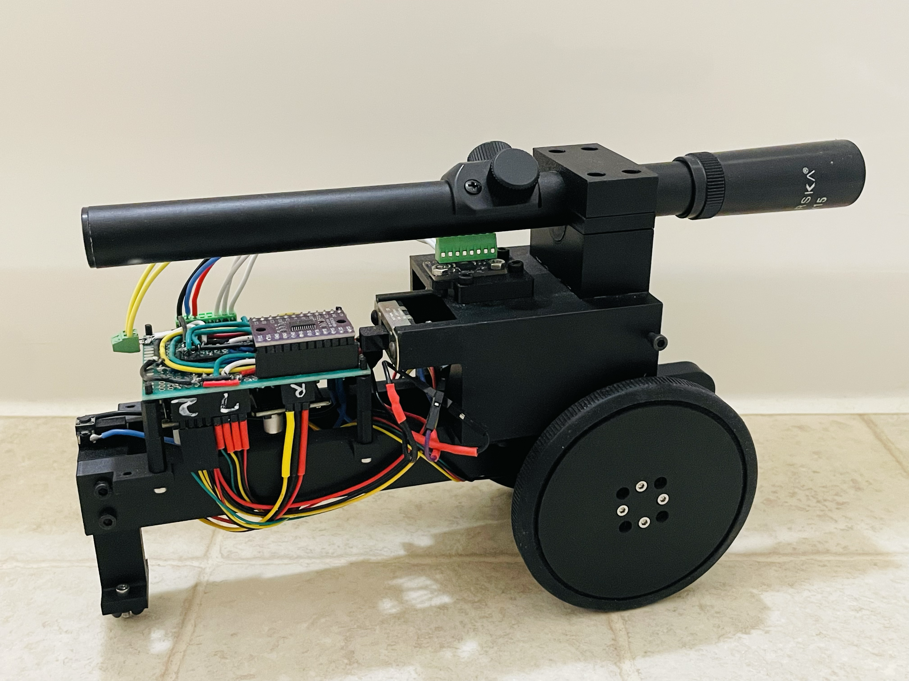

# Scioly-Electric-Vehicle-2026
Full documentation for vehicle built for Science Olympiad division C Electric Vehicle event 
#
Built by Yisun "Ben" Yoo , Savannah Country Day School class of 2027

## Overview
Brief description of your vehicle's purpose and performance goals.

## Features
- Microcontroller: Arduino Nano ESP32
- IMU: BNO_08X
- Batteries: 8 AA 1.2v NiMH rechargeble
- Motor: 4015 gimbal BLDC motor (~400rpm max with 8 1.2vAA batteries)
- Encoder: AS5600 (0.087deg accuracy)

## Vehicle accuracy:
-   +- 1.5cm
-   +- 0.5s
-   gate width minimum: 13cm

## Quick Start
1. Install Arduino IDE
2. Install ESP32 board package
3. Upload `firmware/vehicle-controller.ino`

## Documentation
- [Circuit Design](docs/CIRCUIT.md)
- [Bill of Materials](docs/BOM.md)
- [3D Models](3d-models/)
  

